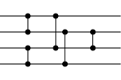
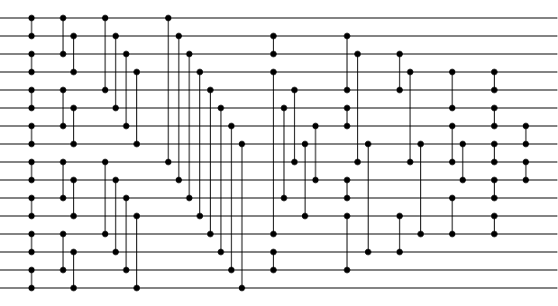

# sorting-network
Python script to check sorting networks and generate sorting network diagrams

## Requirements

* Python 3.10 or later

## Usage

```text
usage: sortingnetwork.py [-h] [--input [inputfile]] {check,print,sort,svg} ...

a tool for working with sorting networks

positional arguments:
  {check,print,sort,svg}
    check               check whether it is a sorting network
    print               print the comparison network definition
    sort                sort a sequence using the input comparison network
    svg                 generate an SVG

options:
  -h, --help            show this help message and exit
  --input [inputfile], -i [inputfile]
                        file containing comparison network definition, or use stdin if not specified
```

Comparison networks can be specified like this: `0:1,2:3,0:2,1:3,1:2` and can either be loaded from a file using the `--input` argument or if no input file is specified, read from stdin.

Multiple lines can be used as well, to logically group the comparators at each depth. `0:1,2:3,0:2,1:3,1:2` is the same as this:
```text
0:1,2:3
0:2,1:3
1:2
```

## Check Command
```text
usage: sortingnetwork.py check [-h] [--show-progress]

check whether it is a sorting network

options:
  -h, --help       show this help message and exit
  --show-progress  show percent complete while checking
```

* If it is a sorting network, the output will be `It is a sorting network!` and the exit code will be 0.   
* If it is not a sorting network, the output will be `It is not a sorting network.` and the exit code will be 1.

You can use the `--show-progress` option to see the percent complete while it is checking.

### Example: Check a comparison network from a file
```shell
./sortingnetwork.py --input example.cn check
```

### Example: Check a comparison network from stdin
```shell
echo "0:1,2:3,0:2,1:3,1:2" | ./sortingnetwork.py check
```

## Print Command
```text
usage: sortingnetwork.py print [-h] [filename]

print the comparison network definition

positional arguments:
  filename    the file to save the output to

options:
  -h, --help  show this help message and exit
```    

* If a filename is not specified, the comparison network will be output to stdout.

### Example: Print the comparison network to a file
```shell
./sortingnetwork.py --input example.cn svg example.svg
```

### Example: Print the comparison network to stdout
```shell
./sortingnetwork.py --input example.cn svg
```

## Sort Command
```text
usage: sortingnetwork.py sort [-h] [sequence]

sort a sequence using the input comparison network

positional arguments:
  sequence    the sequence to sort, e.g. '3,1,2'

options:
  -h, --help  show this help message and exit
```

* The sequence can be a list of any types that can be compared, such as integers or strings, as long as it is parse-able.
* The number of items in the sequence must match the number of inputs in the comparison network.

### Example: Sort a sequence
```shell
./sortingnetwork.py --input example.cn sort 3,1,2
```

## SVG Command
```text
usage: sortingnetwork.py svg [-h] [filename]

generate an SVG

positional arguments:
  filename    the file to save the SVG to

options:
  -h, --help  show this help message and exit
```

* If a filename is not specified, the SVG will be output to stdout.

### Example: Generate an SVG to a file
```shell
./sortingnetwork.py --input example.cn svg example.svg
```

### Example: Generate an SVG to stdout
```shell
./sortingnetwork.py --input example.cn svg
```

### Example pipe the output through rsvg-convert to generate a PNG (or other format) instead of SVG.
(*rsvg-convert can be installed by using `sudo apt-get install librsvg2-bin` on Ubuntu.*)

```shell    
./sortingnetwork.py --input example.cn svg | rsvg-convert > examples/4-input.png
```

## Example sorting networks

### 4-Input
```text
0:1,2:3
0:2,1:3
1:2
```



### 5-Input
```text
0:1,3:4
2:4
2:3,1:4
0:3
0:2,1:3
1:2
```


### 8-Input Bitonic
```text
0:1,2:3,4:5,6:7
0:3,1:2,4:7,5:6
0:1,2:3,4:5,6:7
0:7,1:6,2:5,3:4
0:2,1:3,4:6,5:7
0:1,2:3,4:5,6:7
```


### 16-Input
```text
0:1,2:3,4:5,6:7,8:9,10:11,12:13,14:15
0:2,1:3,4:6,5:7,8:10,9:11,12:14,13:15
0:4,1:5,2:6,3:7,8:12,9:13,10:14,11:15
0:8,1:9,2:10,3:11,4:12,5:13,6:14,7:15
5:10,6:9,3:12,13:14,7:11,1:2,4:8
1:4,7:13,2:8,11:14
2:4,5:6,9:10,11:13,3:8,7:12
6:8,10:12,3:5,7:9
3:4,5:6,7:8,9:10,11:12
6:7,8:9
```



See the [examples](examples) directory for more examples.

## Contributors

* [brianpursley](https://github.com/brianpursley) - Original author / maintainer
* [mizar](https://github.com/mizar) - Various improvements, including and an optimized `is_sorting_network()` function using a [three-valued-logic DFS approach](https://github.com/brianpursley/sorting-network/pull/9).
